### 1. Fitur Login & Autentikasi

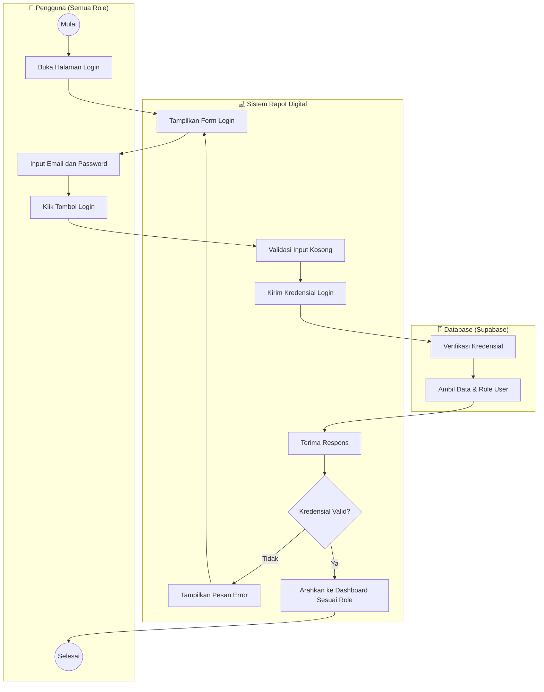
```mermaid
flowchart TD
    subgraph Aktor ["👤 Pengguna (Semua Role)"]
        A1((Mulai))
        A2[Buka Halaman Login]
        A3[Input Email dan Password]
        A4[Klik Tombol Login]
        A5((Selesai))
    end
    
    subgraph Sistem ["💻 Sistem Rapot Digital"]
        S1[Tampilkan Form Login]
        S2[Validasi Input Kosong]
        S3[Kirim Kredensial Login]
        S4[Terima Respons]
        S5{Kredensial Valid?}
        S6[Tampilkan Pesan Error]
        S7[Arahkan ke Dashboard Sesuai Role]
    end
    
    subgraph Database ["🗄️ Database (Supabase)"]
        D1[Verifikasi Kredensial]
        D2[Ambil Data & Role User]
    end

    A1 --> A2
    A2 --> S1
    S1 --> A3
    A3 --> A4
    A4 --> S2
    S2 --> S3
    S3 --> D1
    D1 --> D2
    D2 --> S4
    S4 --> S5
    S5 -- "Tidak" --> S6
    S6 --> S1
    S5 -- "Ya" --> S7
    S7 --> A5
```

### 2. Fitur Kelola Data Master (Oleh Tata Usaha)

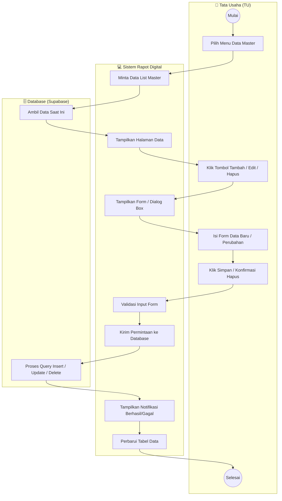
```mermaid
flowchart TD
    subgraph Aktor ["👤 Tata Usaha (TU)"]
        A1((Mulai))
        A2[Pilih Menu Data Master]
        A3[Klik Tombol Tambah / Edit / Hapus]
        A4[Isi Form Data Baru / Perubahan]
        A5[Klik Simpan / Konfirmasi Hapus]
        A6((Selesai))
    end
    
    subgraph Sistem ["💻 Sistem Rapot Digital"]
        S1[Minta Data List Master]
        S2[Tampilkan Halaman Data]
        S3[Tampilkan Form / Dialog Box]
        S4[Validasi Input Form]
        S5[Kirim Permintaan ke Database]
        S6[Tampilkan Notifikasi Berhasil/Gagal]
        S7[Perbarui Tabel Data]
    end
    
    subgraph Database ["🗄️ Database (Supabase)"]
        D1[Ambil Data Saat Ini]
        D2[Proses Query Insert / Update / Delete]
    end

    A1 --> A2
    A2 --> S1
    S1 --> D1
    D1 --> S2
    S2 --> A3
    A3 --> S3
    S3 --> A4
    A4 --> A5
    A5 --> S4
    S4 --> S5
    S5 --> D2
    D2 --> S6
    S6 --> S7
    S7 --> A6
```

### 3. Fitur Input Nilai (Oleh Guru Mapel & Wali Kelas)

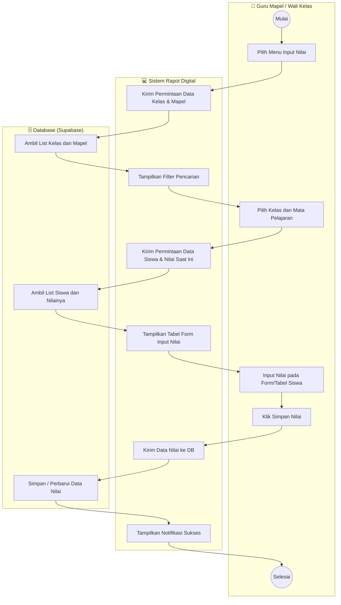
```mermaid
flowchart TD
    subgraph Aktor ["👤 Guru Mapel / Wali Kelas"]
        A1((Mulai))
        A2[Pilih Menu Input Nilai]
        A3[Pilih Kelas dan Mata Pelajaran]
        A4[Input Nilai pada Form/Tabel Siswa]
        A5[Klik Simpan Nilai]
        A6((Selesai))
    end
    
    subgraph Sistem ["💻 Sistem Rapot Digital"]
        S1[Kirim Permintaan Data Kelas & Mapel]
        S2[Tampilkan Filter Pencarian]
        S3[Kirim Permintaan Data Siswa & Nilai Saat Ini]
        S4[Tampilkan Tabel Form Input Nilai]
        S5[Kirim Data Nilai ke DB]
        S6[Tampilkan Notifikasi Sukses]
    end
    
    subgraph Database ["🗄️ Database (Supabase)"]
        D1[Ambil List Kelas dan Mapel]
        D2[Ambil List Siswa dan Nilainya]
        D3[Simpan / Perbarui Data Nilai]
    end

    A1 --> A2
    A2 --> S1
    S1 --> D1
    D1 --> S2
    S2 --> A3
    A3 --> S3
    S3 --> D2
    D2 --> S4
    S4 --> A4
    A4 --> A5
    A5 --> S5
    S5 --> D3
    D3 --> S6
    S6 --> A6
```

### 4. Fitur Cetak Rapor & Input Catatan (Oleh Wali Kelas)

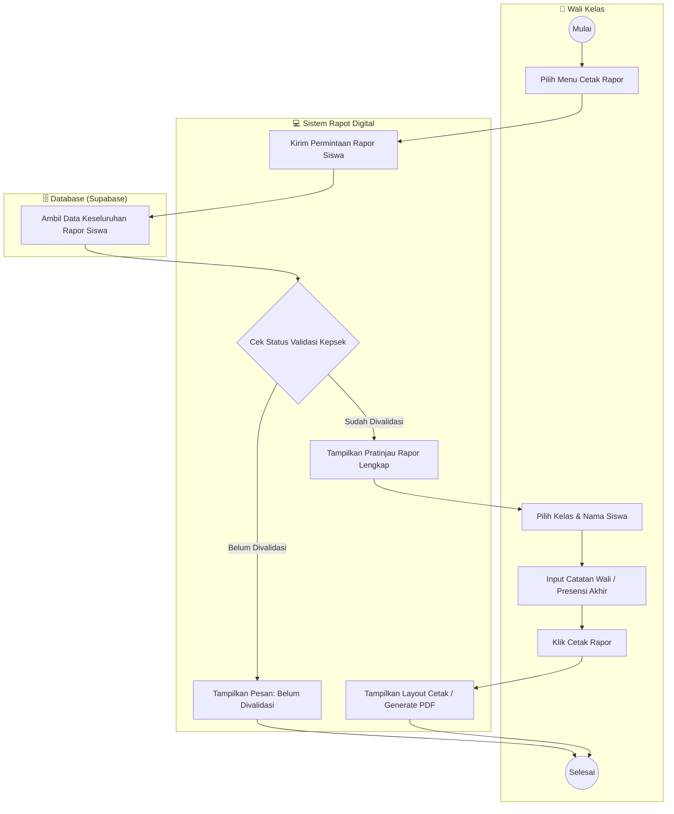
```mermaid
flowchart TD
    subgraph Aktor ["👤 Wali Kelas"]
        A1((Mulai))
        A2[Pilih Menu Cetak Rapor]
        A3[Pilih Kelas & Nama Siswa]
        A4[Input Catatan Wali / Presensi Akhir]
        A5[Klik Cetak Rapor]
        A6((Selesai))
    end
    
    subgraph Sistem ["💻 Sistem Rapot Digital"]
        S1[Kirim Permintaan Rapor Siswa]
        S2{Cek Status Validasi Kepsek}
        S3[Tampilkan Pesan: Belum Divalidasi]
        S4[Tampilkan Pratinjau Rapor Lengkap]
        S5[Tampilkan Layout Cetak / Generate PDF]
    end
    
    subgraph Database ["🗄️ Database (Supabase)"]
        D1[Ambil Data Keseluruhan Rapor Siswa]
    end

    A1 --> A2
    A2 --> S1
    S1 --> D1
    D1 --> S2
    S2 -- "Belum Divalidasi" --> S3
    S3 --> A6
    S2 -- "Sudah Divalidasi" --> S4
    S4 --> A3
    A3 --> A4
    A4 --> A5
    A5 --> S5
    S5 --> A6
```

### 5. Fitur Validasi Rapor (Oleh Kepala Sekolah)

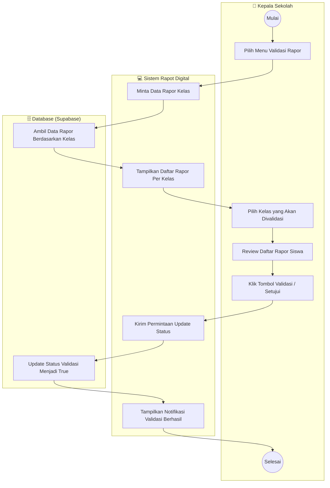
```mermaid
flowchart TD
    subgraph Aktor ["👤 Kepala Sekolah"]
        A1((Mulai))
        A2[Pilih Menu Validasi Rapor]
        A3[Pilih Kelas yang Akan Divalidasi]
        A4[Review Daftar Rapor Siswa]
        A5[Klik Tombol Validasi / Setujui]
        A6((Selesai))
    end
    
    subgraph Sistem ["💻 Sistem Rapot Digital"]
        S1[Minta Data Rapor Kelas]
        S2[Tampilkan Daftar Rapor Per Kelas]
        S3[Kirim Permintaan Update Status]
        S4[Tampilkan Notifikasi Validasi Berhasil]
    end
    
    subgraph Database ["🗄️ Database (Supabase)"]
        D1[Ambil Data Rapor Berdasarkan Kelas]
        D2[Update Status Validasi Menjadi True]
    end

    A1 --> A2
    A2 --> S1
    S1 --> D1
    D1 --> S2
    S2 --> A3
    A3 --> A4
    A4 --> A5
    A5 --> S3
    S3 --> D2
    D2 --> S4
    S4 --> A6
```

### 6. Fitur Lihat Rapor Digital (Oleh Siswa)

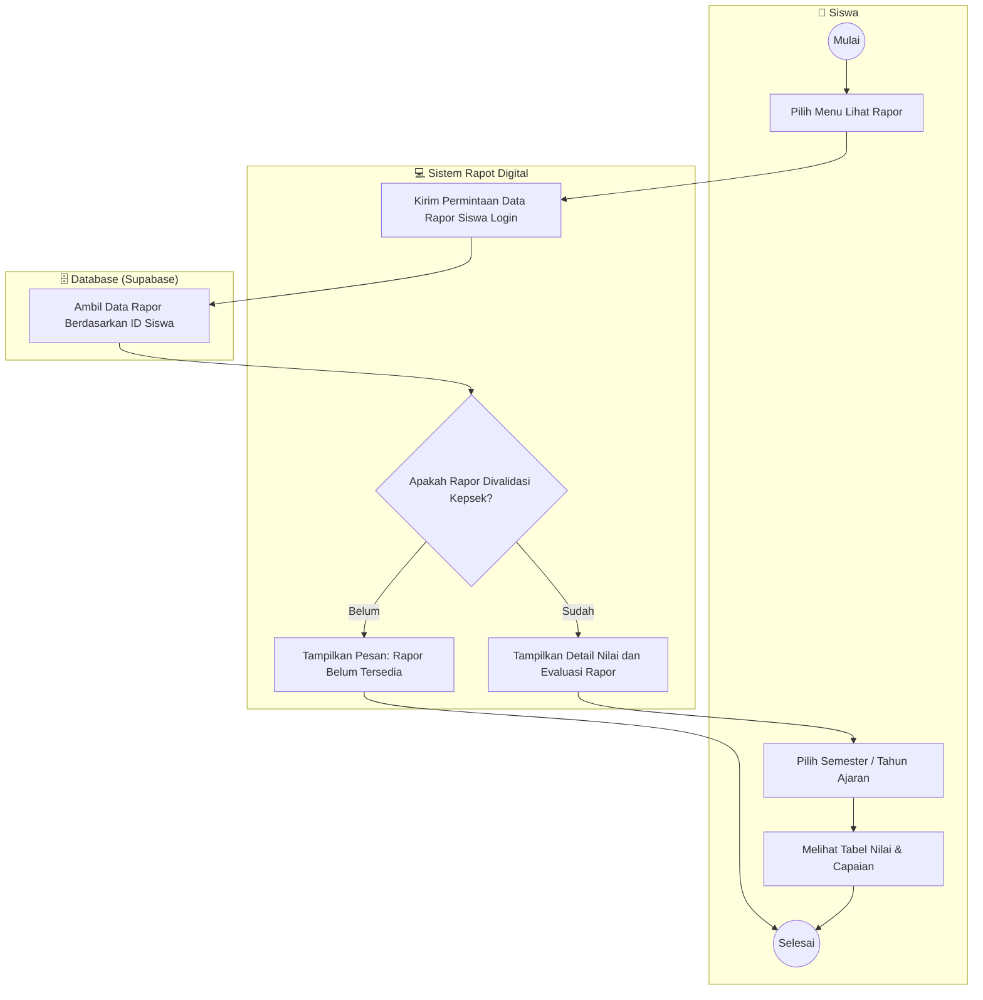
```mermaid
flowchart TD
    subgraph Aktor ["👤 Siswa"]
        A1((Mulai))
        A2[Pilih Menu Lihat Rapor]
        A3[Pilih Semester / Tahun Ajaran]
        A4[Melihat Tabel Nilai & Capaian]
        A5((Selesai))
    end
    
    subgraph Sistem ["💻 Sistem Rapot Digital"]
        S1[Kirim Permintaan Data Rapor Siswa Login]
        S2{Apakah Rapor Divalidasi Kepsek?}
        S3[Tampilkan Pesan: Rapor Belum Tersedia]
        S4[Tampilkan Detail Nilai dan Evaluasi Rapor]
    end
    
    subgraph Database ["🗄️ Database (Supabase)"]
        D1[Ambil Data Rapor Berdasarkan ID Siswa]
    end

    A1 --> A2
    A2 --> S1
    S1 --> D1
    D1 --> S2
    S2 -- "Belum" --> S3
    S3 --> A5
    S2 -- "Sudah" --> S4
    S4 --> A3
    A3 --> A4
    A4 --> A5
```

### 7. Fitur Logout & Sesi Kadaluarsa

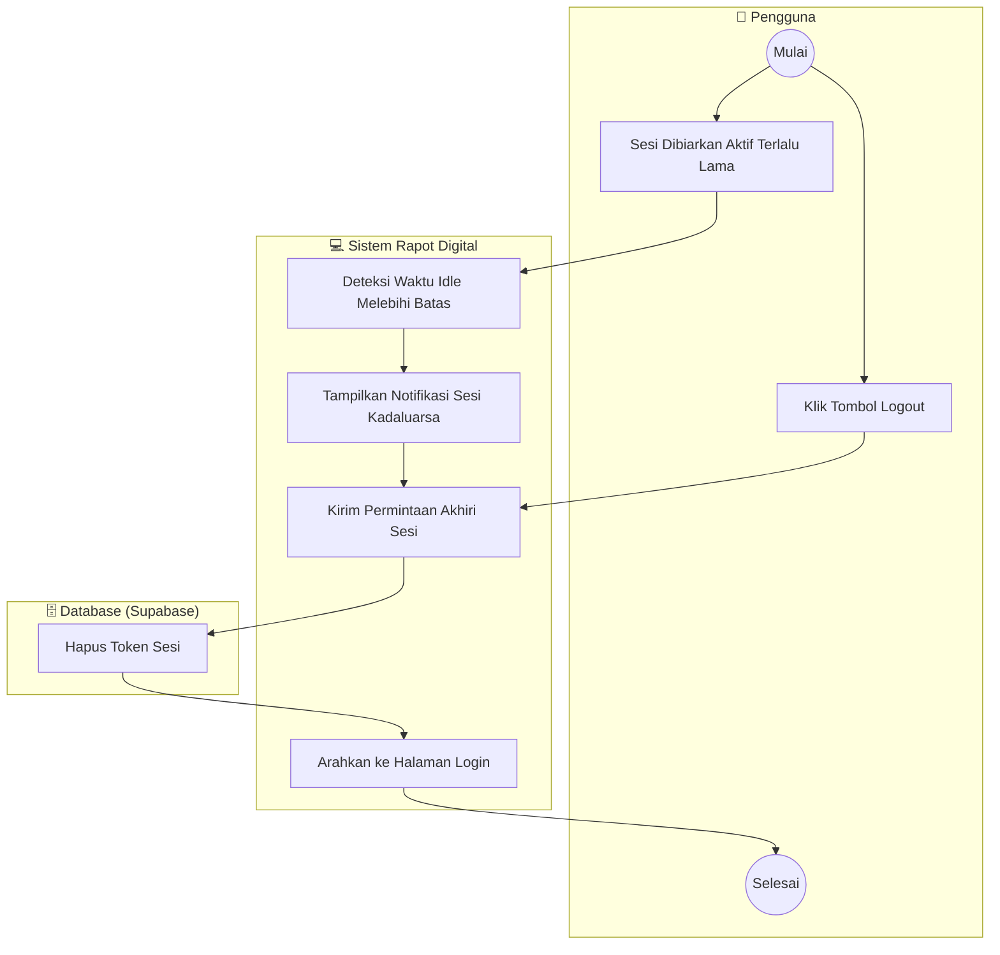
```mermaid
flowchart TD
    subgraph Aktor ["👤 Pengguna"]
        A1((Mulai))
        A2[Klik Tombol Logout]
        A3[Sesi Dibiarkan Aktif Terlalu Lama]
        A4((Selesai))
    end
    
    subgraph Sistem ["💻 Sistem Rapot Digital"]
        S1[Kirim Permintaan Akhiri Sesi]
        S2[Deteksi Waktu Idle Melebihi Batas]
        S3[Tampilkan Notifikasi Sesi Kadaluarsa]
        S4[Arahkan ke Halaman Login]
    end
    
    subgraph Database ["🗄️ Database (Supabase)"]
        D1[Hapus Token Sesi]
    end

    A1 --> A2
    A1 --> A3
    A2 --> S1
    A3 --> S2
    S2 --> S3
    S3 --> S1
    S1 --> D1
    D1 --> S4
    S4 --> A4
```

### 8. Fitur Input & Rekap Absensi Siswa (TU)

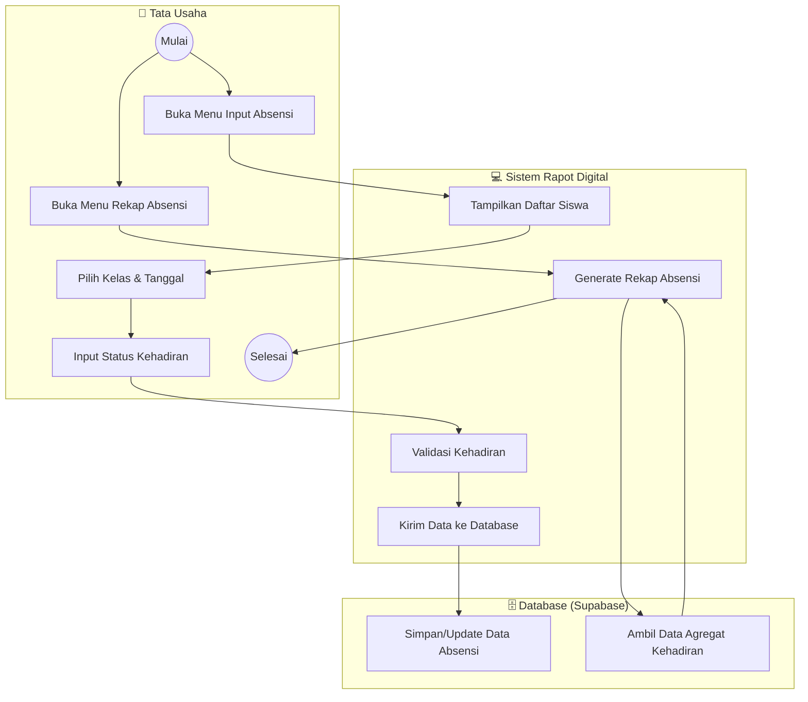
```mermaid
flowchart TD
    subgraph Aktor ["👤 Tata Usaha"]
        A1((Mulai))
        A2[Buka Menu Input Absensi]
        A3[Pilih Kelas & Tanggal]
        A4[Input Status Kehadiran]
        A5[Buka Menu Rekap Absensi]
        A6((Selesai))
    end
    
    subgraph Sistem ["💻 Sistem Rapot Digital"]
        S1[Tampilkan Daftar Siswa]
        S2[Validasi Kehadiran]
        S3[Kirim Data ke Database]
        S4[Generate Rekap Absensi]
    end
    
    subgraph Database ["🗄️ Database (Supabase)"]
        D1[Simpan/Update Data Absensi]
        D2[Ambil Data Agregat Kehadiran]
    end

    A1 --> A2
    A2 --> S1
    S1 --> A3
    A3 --> A4
    A4 --> S2
    S2 --> S3
    S3 --> D1
    
    A1 --> A5
    A5 --> S4
    S4 --> D2
    D2 --> S4
    S4 --> A6
```

### 9. Fitur Input & Koreksi Nilai Lengkap (Guru Mapel)

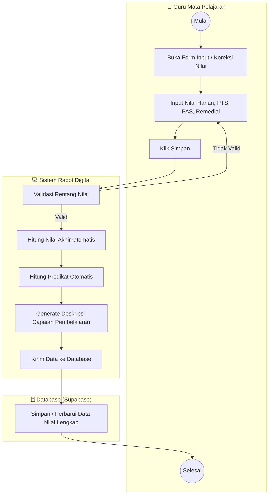
```mermaid
flowchart TD
    subgraph Aktor ["👤 Guru Mata Pelajaran"]
        A1((Mulai))
        A2[Buka Form Input / Koreksi Nilai]
        A3[Input Nilai Harian, PTS, PAS, Remedial]
        A4[Klik Simpan]
        A5((Selesai))
    end
    
    subgraph Sistem ["💻 Sistem Rapot Digital"]
        S1[Validasi Rentang Nilai]
        S2[Hitung Nilai Akhir Otomatis]
        S3[Hitung Predikat Otomatis]
        S4[Generate Deskripsi Capaian Pembelajaran]
        S5[Kirim Data ke Database]
    end
    
    subgraph Database ["🗄️ Database (Supabase)"]
        D1[Simpan / Perbarui Data Nilai Lengkap]
    end

    A1 --> A2
    A2 --> A3
    A3 --> A4
    A4 --> S1
    S1 -- "Tidak Valid" --> A3
    S1 -- "Valid" --> S2
    S2 --> S3
    S3 --> S4
    S4 --> S5
    S5 --> D1
    D1 --> A5
```

### 10. Fitur Pantau Nilai Realtime (Guru & Wali Kelas)

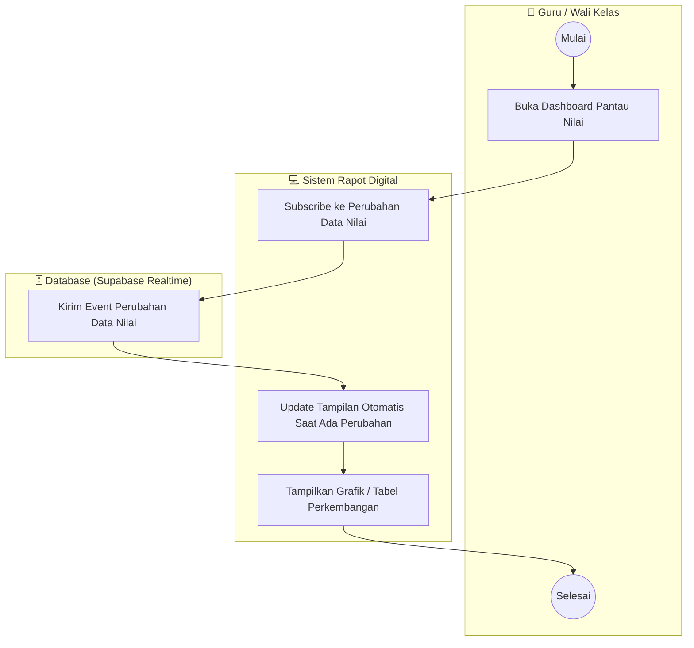
```mermaid
flowchart TD
    subgraph Aktor ["👤 Guru / Wali Kelas"]
        A1((Mulai))
        A2[Buka Dashboard Pantau Nilai]
        A3((Selesai))
    end
    
    subgraph Sistem ["💻 Sistem Rapot Digital"]
        S1[Subscribe ke Perubahan Data Nilai]
        S2[Tampilkan Grafik / Tabel Perkembangan]
        S3[Update Tampilan Otomatis Saat Ada Perubahan]
    end
    
    subgraph Database ["🗄️ Database (Supabase Realtime)"]
        D1[Kirim Event Perubahan Data Nilai]
    end

    A1 --> A2
    A2 --> S1
    S1 --> D1
    D1 --> S3
    S3 --> S2
    S2 --> A3
```

### 11. Fitur Rekap & Validasi Nilai (Wali Kelas)

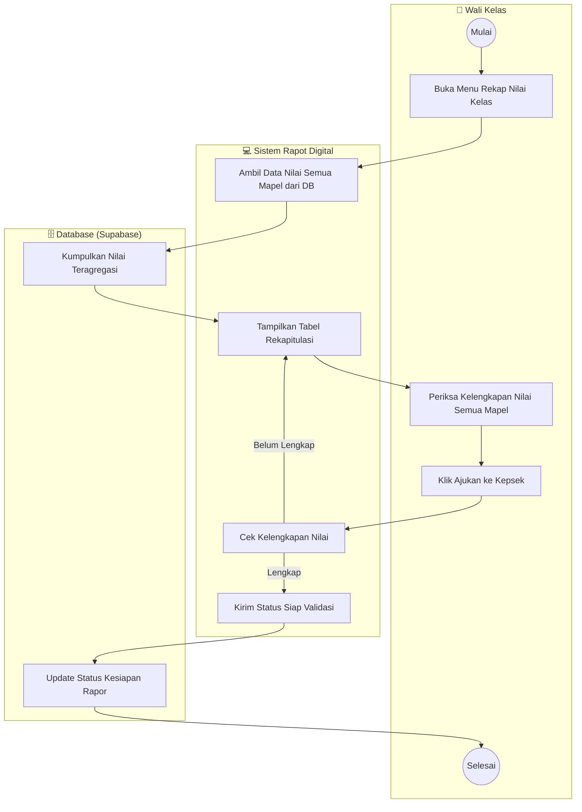
```mermaid
flowchart TD
    subgraph Aktor ["👤 Wali Kelas"]
        A1((Mulai))
        A2[Buka Menu Rekap Nilai Kelas]
        A3[Periksa Kelengkapan Nilai Semua Mapel]
        A4[Klik Ajukan ke Kepsek]
        A5((Selesai))
    end
    
    subgraph Sistem ["💻 Sistem Rapot Digital"]
        S1[Ambil Data Nilai Semua Mapel dari DB]
        S2[Tampilkan Tabel Rekapitulasi]
        S3[Cek Kelengkapan Nilai]
        S4[Kirim Status Siap Validasi]
    end
    
    subgraph Database ["🗄️ Database (Supabase)"]
        D1[Kumpulkan Nilai Teragregasi]
        D2[Update Status Kesiapan Rapor]
    end

    A1 --> A2
    A2 --> S1
    S1 --> D1
    D1 --> S2
    S2 --> A3
    A3 --> A4
    A4 --> S3
    S3 -- "Belum Lengkap" --> S2
    S3 -- "Lengkap" --> S4
    S4 --> D2
    D2 --> A5
```

### 12. Fitur Approve & Tanda Tangan Digital (Kepala Sekolah)

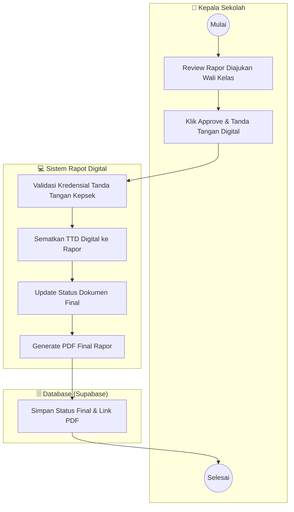
```mermaid
flowchart TD
    subgraph Aktor ["👤 Kepala Sekolah"]
        A1((Mulai))
        A2[Review Rapor Diajukan Wali Kelas]
        A3[Klik Approve & Tanda Tangan Digital]
        A4((Selesai))
    end
    
    subgraph Sistem ["💻 Sistem Rapot Digital"]
        S1[Validasi Kredensial Tanda Tangan Kepsek]
        S2[Sematkan TTD Digital ke Rapor]
        S3[Update Status Dokumen Final]
        S4[Generate PDF Final Rapor]
    end
    
    subgraph Database ["🗄️ Database (Supabase)"]
        D1[Simpan Status Final & Link PDF]
    end

    A1 --> A2
    A2 --> A3
    A3 --> S1
    S1 --> S2
    S2 --> S3
    S3 --> S4
    S4 --> D1
    D1 --> A4
```

### 13. Fitur Lihat Laporan Statistik (Kepala Sekolah)

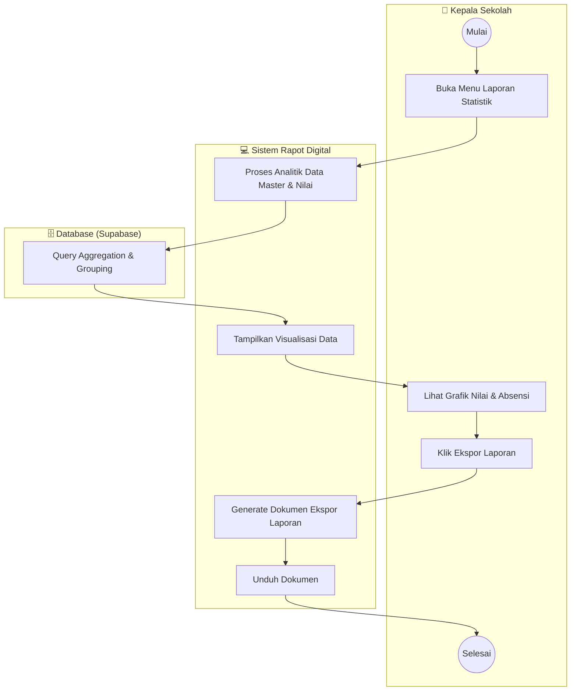
```mermaid
flowchart TD
    subgraph Aktor ["👤 Kepala Sekolah"]
        A1((Mulai))
        A2[Buka Menu Laporan Statistik]
        A3[Lihat Grafik Nilai & Absensi]
        A4[Klik Ekspor Laporan]
        A5((Selesai))
    end
    
    subgraph Sistem ["💻 Sistem Rapot Digital"]
        S1[Proses Analitik Data Master & Nilai]
        S2[Tampilkan Visualisasi Data]
        S3[Generate Dokumen Ekspor Laporan]
        S4[Unduh Dokumen]
    end
    
    subgraph Database ["🗄️ Database (Supabase)"]
        D1[Query Aggregation & Grouping]
    end

    A1 --> A2
    A2 --> S1
    S1 --> D1
    D1 --> S2
    S2 --> A3
    A3 --> A4
    A4 --> S3
    S3 --> S4
    S4 --> A5
```

### 14. Fitur Unduh Rapor (Siswa)

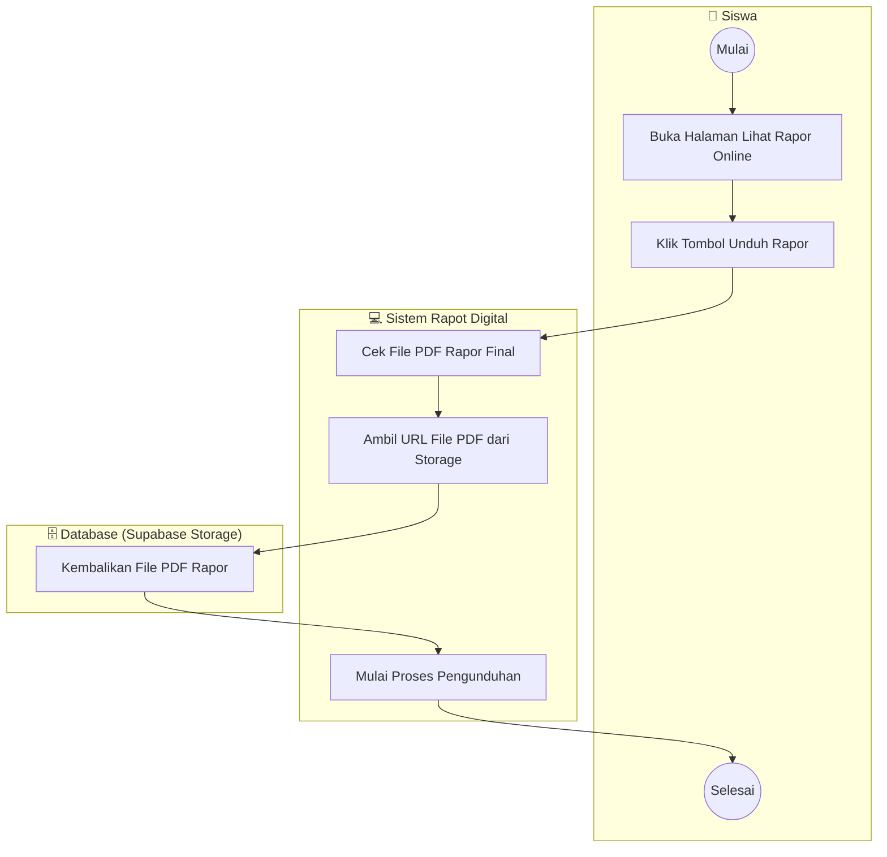
```mermaid
flowchart TD
    subgraph Aktor ["👤 Siswa"]
        A1((Mulai))
        A2[Buka Halaman Lihat Rapor Online]
        A3[Klik Tombol Unduh Rapor]
        A4((Selesai))
    end
    
    subgraph Sistem ["💻 Sistem Rapot Digital"]
        S1[Cek File PDF Rapor Final]
        S2[Ambil URL File PDF dari Storage]
        S3[Mulai Proses Pengunduhan]
    end
    
    subgraph Database ["🗄️ Database (Supabase Storage)"]
        D1[Kembalikan File PDF Rapor]
    end

    A1 --> A2
    A2 --> A3
    A3 --> S1
    S1 --> S2
    S2 --> D1
    D1 --> S3
    S3 --> A4
```

---

## Sequence Diagram

### 1. Sequence Diagram: Fitur Login & Autentikasi

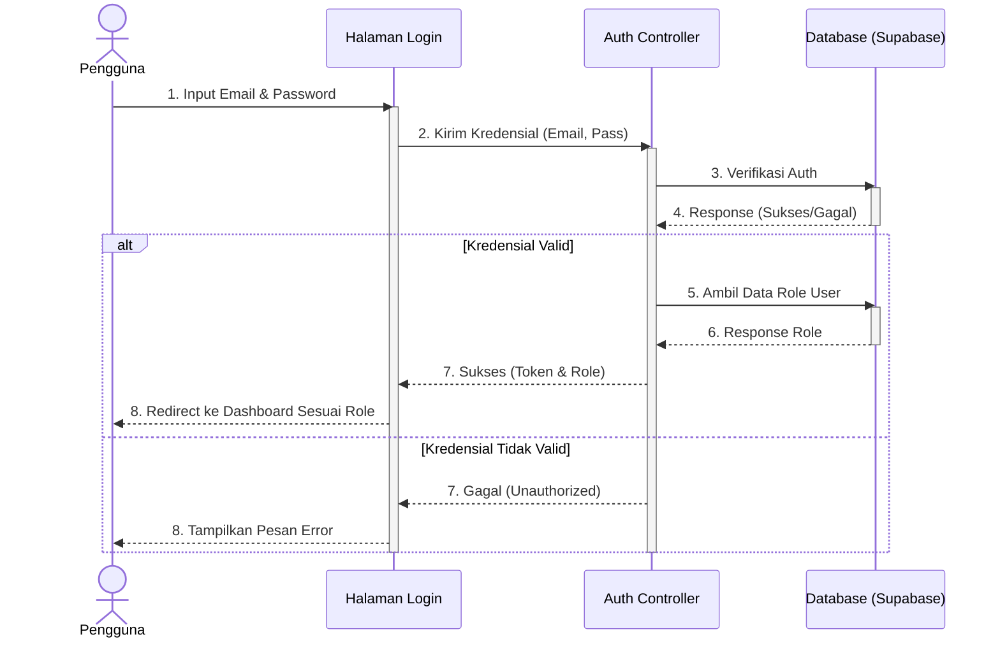
```mermaid
sequenceDiagram
    actor U as Pengguna
    participant UI as Halaman Login
    participant Auth as Auth Controller
    participant DB as Database (Supabase)

    U->>UI: 1. Input Email & Password
    activate UI
    UI->>Auth: 2. Kirim Kredensial (Email, Pass)
    activate Auth
    Auth->>DB: 3. Verifikasi Auth
    activate DB
    DB-->>Auth: 4. Response (Sukses/Gagal)
    deactivate DB
    
    alt Kredensial Valid
        Auth->>DB: 5. Ambil Data Role User
        activate DB
        DB-->>Auth: 6. Response Role
        deactivate DB
        Auth-->>UI: 7. Sukses (Token & Role)
        UI-->>U: 8. Redirect ke Dashboard Sesuai Role
    else Kredensial Tidak Valid
        Auth-->>UI: 7. Gagal (Unauthorized)
        UI-->>U: 8. Tampilkan Pesan Error
    end
    deactivate Auth
    deactivate UI
```

### 2. Sequence Diagram: Fitur Kelola Data Master (TU)

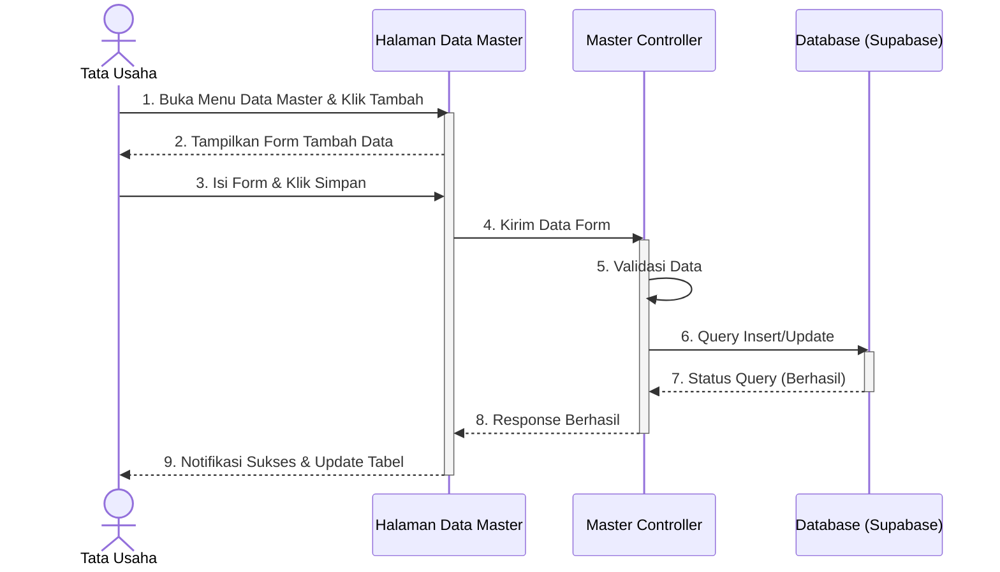
```mermaid
sequenceDiagram
    actor TU as Tata Usaha
    participant UI as Halaman Data Master
    participant API as Master Controller
    participant DB as Database (Supabase)

    TU->>UI: 1. Buka Menu Data Master & Klik Tambah
    activate UI
    UI-->>TU: 2. Tampilkan Form Tambah Data
    TU->>UI: 3. Isi Form & Klik Simpan
    UI->>API: 4. Kirim Data Form
    activate API
    API->>API: 5. Validasi Data
    API->>DB: 6. Query Insert/Update
    activate DB
    DB-->>API: 7. Status Query (Berhasil)
    deactivate DB
    API-->>UI: 8. Response Berhasil
    deactivate API
    UI-->>TU: 9. Notifikasi Sukses & Update Tabel
    deactivate UI
```

### 3. Sequence Diagram: Fitur Input Nilai (Guru Mapel & Wali Kelas)

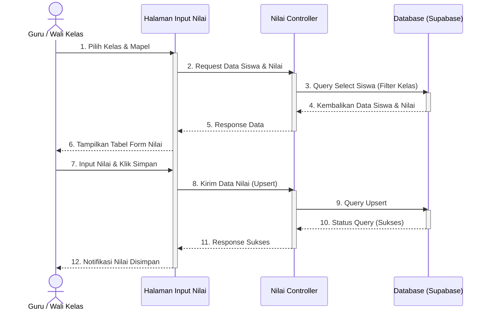
```mermaid
sequenceDiagram
    actor G as Guru / Wali Kelas
    participant UI as Halaman Input Nilai
    participant API as Nilai Controller
    participant DB as Database (Supabase)

    G->>UI: 1. Pilih Kelas & Mapel
    activate UI
    UI->>API: 2. Request Data Siswa & Nilai
    activate API
    API->>DB: 3. Query Select Siswa (Filter Kelas)
    activate DB
    DB-->>API: 4. Kembalikan Data Siswa & Nilai
    deactivate DB
    API-->>UI: 5. Response Data
    deactivate API
    UI-->>G: 6. Tampilkan Tabel Form Nilai
    
    G->>UI: 7. Input Nilai & Klik Simpan
    UI->>API: 8. Kirim Data Nilai (Upsert)
    activate API
    API->>DB: 9. Query Upsert
    activate DB
    DB-->>API: 10. Status Query (Sukses)
    deactivate DB
    API-->>UI: 11. Response Sukses
    deactivate API
    UI-->>G: 12. Notifikasi Nilai Disimpan
    deactivate UI
```

### 4. Sequence Diagram: Fitur Cetak Rapor & Input Catatan (Wali Kelas)

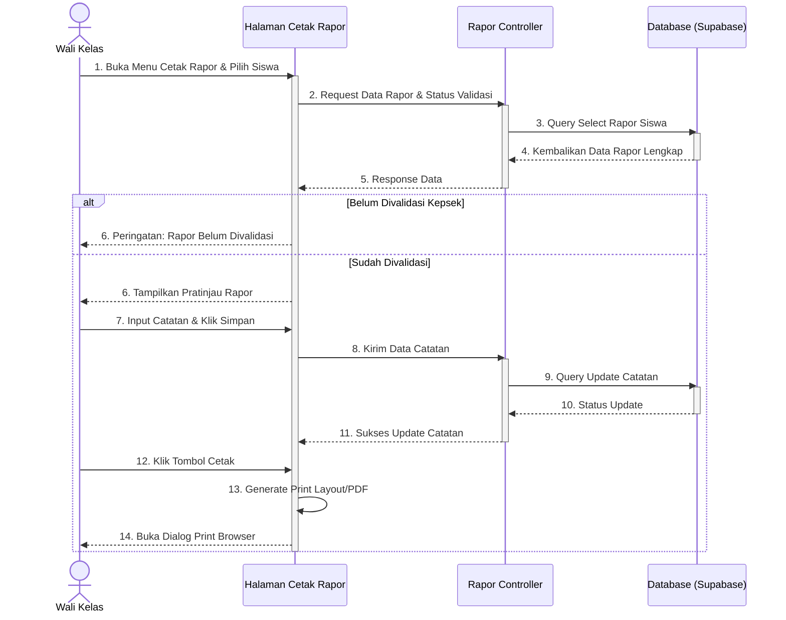
```mermaid
sequenceDiagram
    actor W as Wali Kelas
    participant UI as Halaman Cetak Rapor
    participant API as Rapor Controller
    participant DB as Database (Supabase)

    W->>UI: 1. Buka Menu Cetak Rapor & Pilih Siswa
    activate UI
    UI->>API: 2. Request Data Rapor & Status Validasi
    activate API
    API->>DB: 3. Query Select Rapor Siswa
    activate DB
    DB-->>API: 4. Kembalikan Data Rapor Lengkap
    deactivate DB
    API-->>UI: 5. Response Data
    deactivate API
    
    alt Belum Divalidasi Kepsek
        UI-->>W: 6. Peringatan: Rapor Belum Divalidasi
    else Sudah Divalidasi
        UI-->>W: 6. Tampilkan Pratinjau Rapor
        W->>UI: 7. Input Catatan & Klik Simpan
        UI->>API: 8. Kirim Data Catatan
        activate API
        API->>DB: 9. Query Update Catatan
        activate DB
        DB-->>API: 10. Status Update
        deactivate DB
        API-->>UI: 11. Sukses Update Catatan
        deactivate API
        
        W->>UI: 12. Klik Tombol Cetak
        UI->>UI: 13. Generate Print Layout/PDF
        UI-->>W: 14. Buka Dialog Print Browser
    end
    deactivate UI
```

### 5. Sequence Diagram: Fitur Validasi Rapor (Kepala Sekolah)

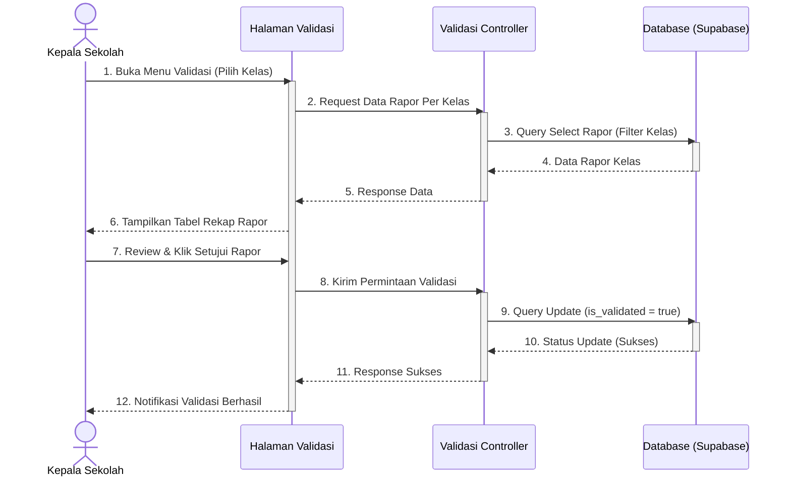
```mermaid
sequenceDiagram
    actor K as Kepala Sekolah
    participant UI as Halaman Validasi
    participant API as Validasi Controller
    participant DB as Database (Supabase)

    K->>UI: 1. Buka Menu Validasi (Pilih Kelas)
    activate UI
    UI->>API: 2. Request Data Rapor Per Kelas
    activate API
    API->>DB: 3. Query Select Rapor (Filter Kelas)
    activate DB
    DB-->>API: 4. Data Rapor Kelas
    deactivate DB
    API-->>UI: 5. Response Data
    deactivate API
    UI-->>K: 6. Tampilkan Tabel Rekap Rapor
    
    K->>UI: 7. Review & Klik Setujui Rapor
    UI->>API: 8. Kirim Permintaan Validasi
    activate API
    API->>DB: 9. Query Update (is_validated = true)
    activate DB
    DB-->>API: 10. Status Update (Sukses)
    deactivate DB
    API-->>UI: 11. Response Sukses
    deactivate API
    UI-->>K: 12. Notifikasi Validasi Berhasil
    deactivate UI
```

### 6. Sequence Diagram: Fitur Lihat Rapor Digital (Siswa)

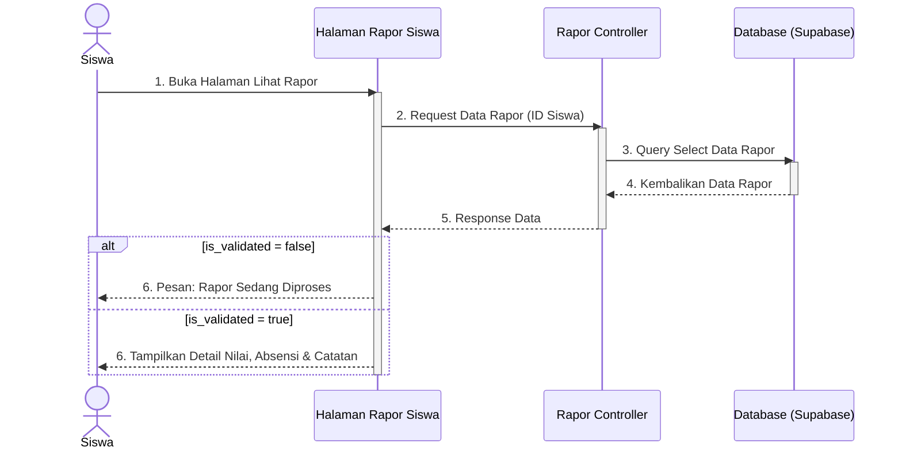
```mermaid
sequenceDiagram
    actor Siswa as Siswa
    participant UI as Halaman Rapor Siswa
    participant API as Rapor Controller
    participant DB as Database (Supabase)

    Siswa->>UI: 1. Buka Halaman Lihat Rapor
    activate UI
    UI->>API: 2. Request Data Rapor (ID Siswa)
    activate API
    API->>DB: 3. Query Select Data Rapor
    activate DB
    DB-->>API: 4. Kembalikan Data Rapor
    deactivate DB
    API-->>UI: 5. Response Data
    deactivate API
    
    alt is_validated = false
        UI-->>Siswa: 6. Pesan: Rapor Sedang Diproses
    else is_validated = true
        UI-->>Siswa: 6. Tampilkan Detail Nilai, Absensi & Catatan
    end
    deactivate UI
```

### 7. Sequence Diagram: Fitur Logout & Sesi Kadaluarsa

```mermaid
sequenceDiagram
    actor U as Pengguna
    participant UI as Antarmuka Aplikasi
    participant Auth as Auth Controller
    participant DB as Database (Supabase)

    alt Manual Logout
        U->>UI: 1. Klik Logout
    else Sesi Kadaluarsa
        UI->>UI: 1. Deteksi Waktu Idle Habis
        UI-->>U: 2. Tampilkan Notif Sesi Kadaluarsa
    end
    
    activate UI
    UI->>Auth: 3. Request Akhiri Sesi
    activate Auth
    Auth->>DB: 4. Hapus Token/Sesi Aktif
    activate DB
    DB-->>Auth: 5. Konfirmasi Sesi Dihapus
    deactivate DB
    Auth-->>UI: 6. Response Sukses
    deactivate Auth
    UI-->>U: 7. Arahkan ke Halaman Login
    deactivate UI
```

### 8. Sequence Diagram: Fitur Input & Rekap Absensi (TU)

```mermaid
sequenceDiagram
    actor TU as Tata Usaha
    participant UI as Halaman Absensi
    participant API as Absensi Controller
    participant DB as Database (Supabase)

    TU->>UI: 1. Pilih Kelas & Tanggal, Input Data
    activate UI
    UI->>API: 2. Kirim Data Absensi
    activate API
    API->>API: 3. Validasi Kehadiran
    API->>DB: 4. Query Insert / Update
    activate DB
    DB-->>API: 5. Status Simpan Berhasil
    deactivate DB
    API-->>UI: 6. Response Sukses
    deactivate API
    UI-->>TU: 7. Notifikasi Berhasil Disimpan
    
    TU->>UI: 8. Klik Rekap Absensi
    UI->>API: 9. Request Data Rekap (Bulan/Semester)
    activate API
    API->>DB: 10. Query Agregasi Absensi
    activate DB
    DB-->>API: 11. Kembalikan Data Rekap
    deactivate DB
    API-->>UI: 12. Format Data Rekap
    deactivate API
    UI-->>TU: 13. Tampilkan Tabel Rekap
    deactivate UI
```

### 9. Sequence Diagram: Fitur Input & Koreksi Nilai Lengkap (Guru Mapel)

```mermaid
sequenceDiagram
    actor G as Guru Mapel
    participant UI as Form Input Nilai
    participant API as Kalkulasi Penilaian API
    participant DB as Database (Supabase)

    G->>UI: 1. Input Nilai (Harian, PTS, PAS, Remedial)
    activate UI
    UI->>API: 2. Kirim Data Raw Nilai
    activate API
    
    API->>API: 3. Validasi Rentang Nilai (0-100)
    alt Nilai Tidak Valid
        API-->>UI: 4. Error: Nilai di luar rentang
        UI-->>G: 5. Tampilkan Pesan Error
    else Nilai Valid
        API->>API: 4. Hitung Nilai Akhir Otomatis
        API->>API: 5. Tentukan Predikat (A/B/C/D)
        API->>API: 6. Generate Deskripsi Capaian
        API->>DB: 7. Upsert Data Nilai Lengkap
        activate DB
        DB-->>API: 8. Konfirmasi Tersimpan
        deactivate DB
        API-->>UI: 9. Response Data Final
        UI-->>G: 10. Tampilkan Nilai Akhir & Predikat
    end
    deactivate API
    deactivate UI
```

### 10. Sequence Diagram: Fitur Pantau Nilai Realtime (Guru & Wali Kelas)

```mermaid
sequenceDiagram
    actor U as Guru / Wali Kelas
    participant UI as Dashboard Realtime
    participant WS as Supabase Realtime (WebSocket)
    participant DB as Database (Supabase)

    U->>UI: 1. Buka Halaman Dashboard
    activate UI
    UI->>WS: 2. Subscribe ke Channel Nilai
    activate WS
    WS-->>UI: 3. Status Berlangganan Aktif
    UI-->>U: 4. Tampilkan Data Awal
    
    note over WS, DB: Terjadi perubahan data (Insert/Update)
    DB->>WS: 5. Trigger Update Data Event
    activate DB
    deactivate DB
    WS->>UI: 6. Push Notification Data Baru
    UI->>UI: 7. Re-render Tampilan Otomatis
    UI-->>U: 8. Tampilan Data Diperbarui
    deactivate WS
    deactivate UI
```

### 11. Sequence Diagram: Fitur Rekap & Validasi Nilai (Wali Kelas)

```mermaid
sequenceDiagram
    actor W as Wali Kelas
    participant UI as Halaman Rekap Kelas
    participant API as Rekap Controller
    participant DB as Database (Supabase)

    W->>UI: 1. Buka Menu Rekap Kelas
    activate UI
    UI->>API: 2. Request Status Pengisian Semua Mapel
    activate API
    API->>DB: 3. Query Cek Kelengkapan Data Nilai
    activate DB
    DB-->>API: 4. Kembalikan Data Kelengkapan
    deactivate DB
    API-->>UI: 5. Format Data Kelengkapan
    deactivate API
    UI-->>W: 6. Tampilkan Tabel Rekap Nilai
    
    W->>UI: 7. Klik Ajukan Validasi Ke Kepsek
    UI->>API: 8. Kirim Permintaan Finalisasi Kelas
    activate API
    API->>DB: 9. Update Status (Siap Divalidasi)
    activate DB
    DB-->>API: 10. Konfirmasi Berhasil
    deactivate DB
    API-->>UI: 11. Response Sukses
    deactivate API
    UI-->>W: 12. Notifikasi Berhasil Diajukan
    deactivate UI
```

### 12. Sequence Diagram: Fitur Approve & Tanda Tangan Digital (Kepala Sekolah)

```mermaid
sequenceDiagram
    actor K as Kepala Sekolah
    participant UI as Halaman Persetujuan
    participant API as Approval & PDF API
    participant DB as Database (Supabase)

    K->>UI: 1. Pilih Rapor & Klik Approve & TTD
    activate UI
    UI->>API: 2. Kirim Perintah Approval (Kredensial TTD)
    activate API
    API->>API: 3. Verifikasi Tanda Tangan Digital
    API->>API: 4. Generate Embed QR Code TTD
    API->>API: 5. Generate PDF Final (Include TTD)
    API->>DB: 6. Simpan URL PDF & Ubah Status Final
    activate DB
    DB-->>API: 7. Konfirmasi Tersimpan
    deactivate DB
    API-->>UI: 8. Response Link PDF
    deactivate API
    UI-->>K: 9. Notifikasi Rapor Disetujui
    deactivate UI
```

### 13. Sequence Diagram: Fitur Lihat Laporan Statistik & Ekspor (Kepala Sekolah)

```mermaid
sequenceDiagram
    actor K as Kepala Sekolah
    participant UI as Halaman Laporan Statistik
    participant API as Analitik Controller
    participant DB as Database (Supabase)

    K->>UI: 1. Buka Menu Laporan Statistik
    activate UI
    UI->>API: 2. Request Data Analitik
    activate API
    API->>DB: 3. Query Agregasi Data
    activate DB
    DB-->>API: 4. Kembalikan Data Statistik
    deactivate DB
    API-->>UI: 5. Format Data Statistik (JSON)
    deactivate API
    UI-->>K: 6. Tampilkan Grafik & Visualisasi
    
    K->>UI: 7. Klik Ekspor Laporan (Excel/PDF)
    UI->>API: 8. Request Generate File Laporan
    activate API
    API->>API: 9. Generate Dokumen Excel/PDF
    API-->>UI: 10. Kembalikan Link Download
    deactivate API
    UI-->>K: 11. Mulai Pengunduhan
    deactivate UI
```

### 14. Sequence Diagram: Fitur Unduh Rapor (Siswa)

```mermaid
sequenceDiagram
    actor Siswa as Siswa
    participant UI as Halaman Rapor Siswa
    participant API as Download Controller
    participant Storage as Database (Supabase Storage)

    Siswa->>UI: 1. Klik Tombol Unduh Rapor
    activate UI
    UI->>API: 2. Request File Rapor (ID Siswa)
    activate API
    API->>Storage: 3. Ambil URL File PDF Final
    activate Storage
    Storage-->>API: 4. Kembalikan Link File PDF
    deactivate Storage
    API-->>UI: 5. Response Link Unduh
    deactivate API
    UI->>UI: 6. Trigger Download Browser
    UI-->>Siswa: 7. File Terunduh
    deactivate UI
```
