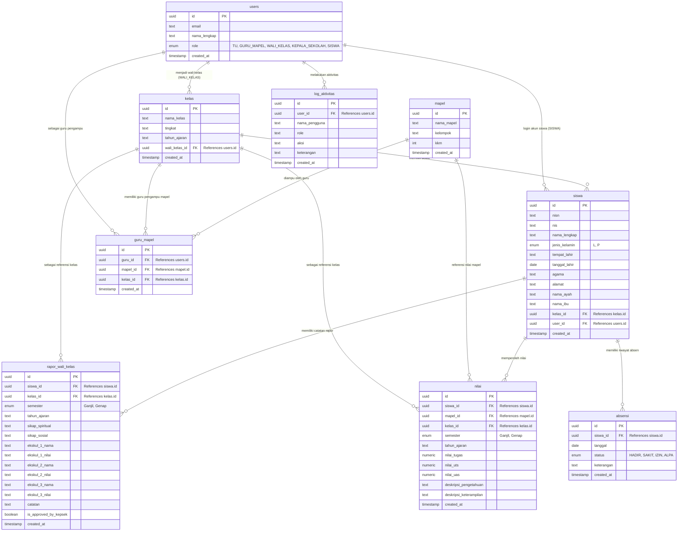

# Entity-Relationship Diagram (ERD) Sistem Rapot Digital

Dokumen ini berisi struktur database (ERD) berdasarkan skema Supabase (`schema.sql`, `schema_tahap3.sql`, `schema_tahap4.sql`, `schema_tahap5.sql`, `schema_tahap6.sql`, dan `schema_audit_log.sql`).

## Daftar Tabel dan Deskripsi Singkat:
1. **users**: Menyimpan data autentikasi dan peran semua pengguna (TU, Guru Mapel, Wali Kelas, Kepala Sekolah, Siswa).
2. **kelas**: Menyimpan daftar kelas, tingkat, tahun ajaran, beserta siapa wali kelasnya.
3. **siswa**: Menyimpan biodata lengkap siswa, terhubung ke kelas dan juga terhubung ke `users` untuk akses login.
4. **mapel**: Menyimpan data master mata pelajaran beserta nilai KKM.
5. **guru_mapel**: Tabel perantara (transaksi) yang memetakan guru (dari `users`), mengajar `mapel` apa, dan di `kelas` mana.
6. **absensi**: Menyimpan data riwayat kehadiran siswa per hari (Hadir/Sakit/Izin/Alpa).
7. **nilai**: Menyimpan nilai tugas, UTS, UAS, dan deskripsi penilaian siswa untuk tiap mata pelajaran, semester, dan tahun ajaran.
8. **rapor_wali_kelas**: Menyimpan penilaian sikap (spiritual, sosial), ekstrakurikuler, catatan khusus dari wali kelas, serta status persetujuan (_approval_) dari Kepala Sekolah.
9. **log_aktivitas**: Menyimpan riwayat semua aktivitas yang dilakukan oleh pengguna (Audit Trail).
